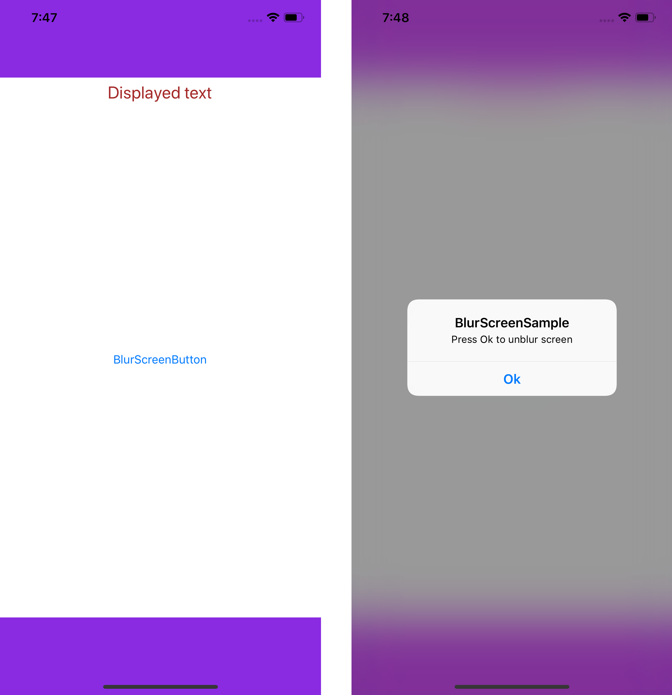

# Blur Screen Plugin for Xamarin iOS and Android
Simple cross platform plugin for bluring entire screen. Uses FragmentDialog for Android and UIViewController for iOS.

### Setup
* Available on NuGet: https://www.nuget.org/packages/Xam.Plugin.BlurScreen 
* Install into your Core project and Client projects.

### API Usage

Call **CrossBlurScreen.Current** from any project to gain access to APIs.

Examples: 
 1) CrossBlurScreen.Current.Blur();
 2) CrossBlurScreen.Current.Unblur();
 
 ### Important
 You should use AppCompatActivity on Android
 
 ### Dependencies
 BlurScreenPlugin for Xamarin.Android depends on CurrentActivityPlugin, so you shoud initialize it in your project: https://github.com/jamesmontemagno/CurrentActivityPlugin#version-20
 
 ### Screenshots
 
